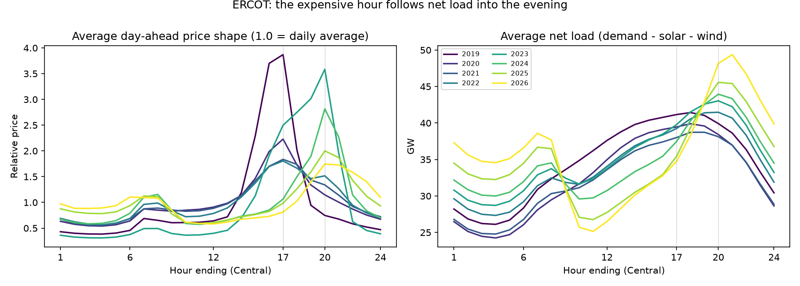
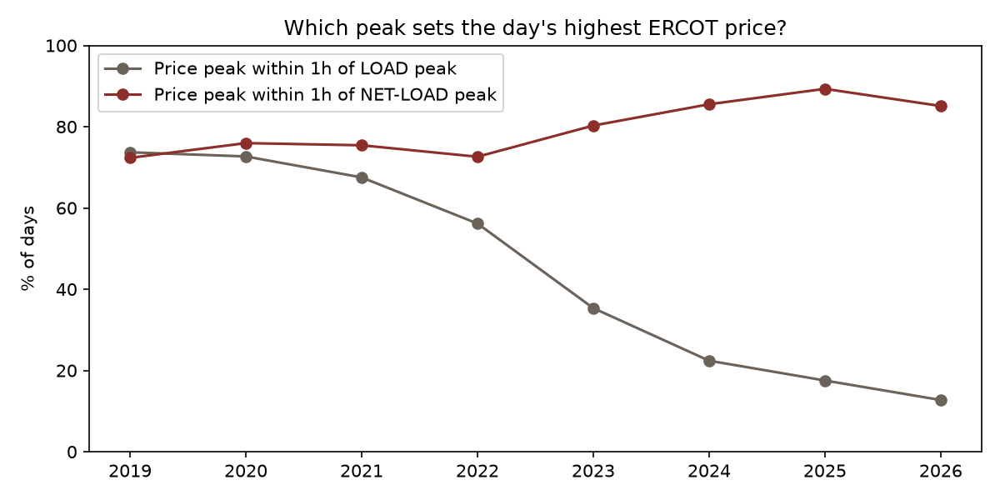
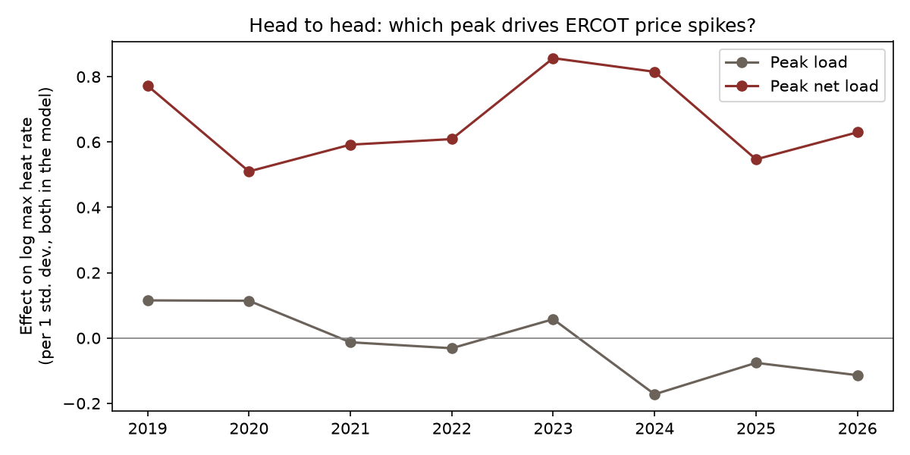

# E1 - ERCOT scarcity has moved from the load peak to the net-load peak

**Thesis.** As Texas solar grew, the most expensive hour of the day moved from the afternoon load peak
to the evening net-load peak, when the sun is down but demand is still high. Peak *net* load should now
explain the day's highest price better than peak load, and that advantage should have grown.

**Verdict.** **Supported.** The price peak moved into the evening with the net-load peak, net load now explains daily price spikes better than load, and the gap between them widened significantly over time.

Data: ERCOT hourly day-ahead prices at HB_HUBAVG (the average of ERCOT's trading hubs), EIA-930 hourly
demand, solar and wind, Henry Hub gas. 2,821 days, 2019-2026, excluding Winter Storm Uri (Feb 10-20, 2021).

## 1. The expensive hour moved

|   year |   price_peak_he |   load_peak_he |   netload_peak_he | within_1h_of_load_peak   | within_1h_of_netload_peak   | solar_share   |
|-------:|----------------:|---------------:|------------------:|:-------------------------|:----------------------------|:--------------|
|   2019 |              17 |             17 |                17 | 74%                      | 72%                         | 1%            |
|   2020 |              17 |             17 |                17 | 73%                      | 76%                         | 2%            |
|   2021 |              17 |             17 |                17 | 68%                      | 75%                         | 4%            |
|   2022 |              17 |             17 |                20 | 56%                      | 73%                         | 5%            |
|   2023 |              20 |             17 |                20 | 35%                      | 80%                         | 7%            |
|   2024 |              20 |             17 |                21 | 22%                      | 86%                         | 10%           |
|   2025 |              20 |             17 |                21 | 18%                      | 89%                         | 14%           |
|   2026 |              20 |             17 |                21 | 13%                      | 85%                         | 17%           |

## 2. Head to head, year by year

Daily max price is converted to a heat rate (÷ gas) and logged, because spikes are multiplicative and gas
moved from $2 to $9 over the sample. Each year is fit separately with month fixed effects.

|   year |   days |   R² load |   R² net load |   std coef load |   std coef net load |   p net load |   net load advantage |
|-------:|-------:|----------:|--------------:|----------------:|--------------------:|-------------:|---------------------:|
|   2019 |    365 |     0.666 |         0.734 |           0.115 |               0.772 |            0 |                0.068 |
|   2020 |    366 |     0.465 |         0.584 |           0.114 |               0.51  |            0 |                0.119 |
|   2021 |    354 |     0.276 |         0.545 |          -0.013 |               0.592 |            0 |                0.269 |
|   2022 |    365 |     0.316 |         0.562 |          -0.031 |               0.609 |            0 |                0.246 |
|   2023 |    365 |     0.601 |         0.703 |           0.058 |               0.857 |            0 |                0.102 |
|   2024 |    366 |     0.325 |         0.612 |          -0.172 |               0.815 |            0 |                0.286 |
|   2025 |    365 |     0.361 |         0.687 |          -0.076 |               0.547 |            0 |                0.326 |
|   2026 |    275 |     0.368 |         0.692 |          -0.114 |               0.63  |            0 |                0.323 |

Average R² advantage of net load over load: +0.152 in 2019-2021, +0.259 in 2023 onward.

## 3. Pooled test of a growing effect

One regression over all years with each peak interacted with a time trend (HAC s.e.):

| term | coef | s.e. | p-value |
|---|---|---|---|
| net load x trend (per year) | +0.015 | 0.017 | 0.373 |
| load x trend (per year) | -0.072 | 0.015 | 0.000 |
| **gap: net load minus load, per year** | **+0.087** | 0.030 | 0.004 |

**How to read this.** Net load's own effect did not grow: it was already the stronger driver in 2019, because even before much solar, *wind* made net load differ from load. What changed is that plain load **lost** its explanatory power, falling significantly every year. The shift is real, but it happened by load becoming irrelevant, not by net load becoming more important.

## Trade expression (hypothesis, not advice)

Scarcity value in ERCOT now sits in the HE19-22 window, not the traditional 4-6pm block. Shaped products
that cover the evening ramp (or ERCOT's 7x8 / HE19-22 blocks) carry the convexity that HE14-18 used to.
For asset owners, it means storage and evening-capable gas are capturing the scarcity rent that solar
erased from the afternoon. The next question is whether storage is now compressing that evening premium
too, which is thesis E2.

## Caveats

- Day-ahead prices only. Real-time scarcity (the $5,000 cap events) is spikier and can differ.
- EIA-930 net load excludes behind-the-meter solar, so true customer demand is a little higher at midday.
- Peak *timing* uses the mode across days; individual days vary, especially in shoulder months.
