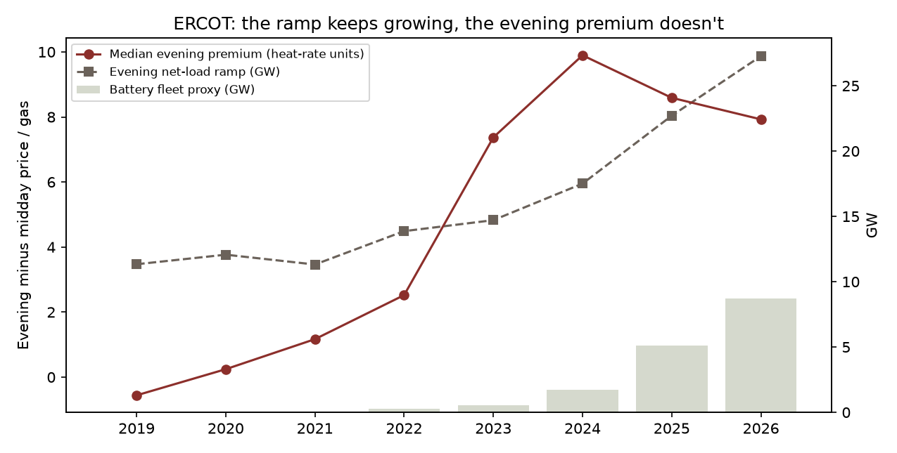
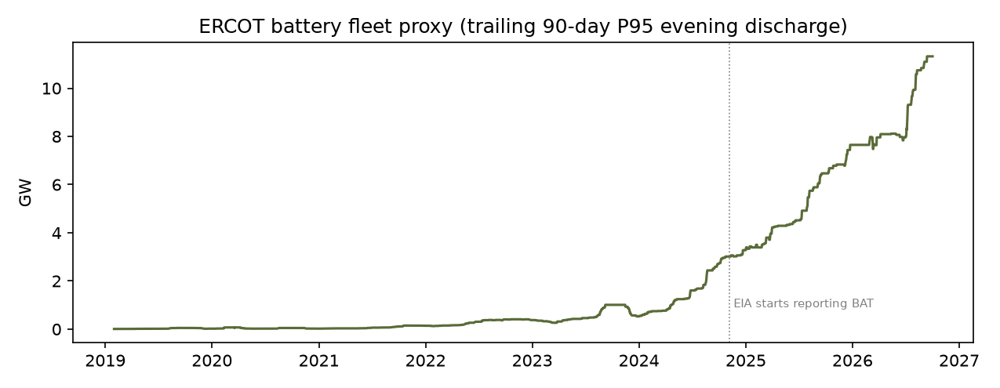
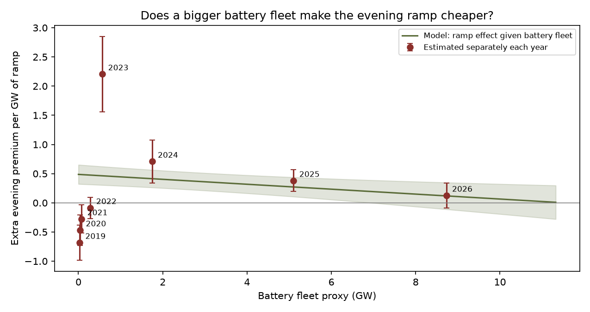

# E2 - ERCOT's battery fleet is flattening the evening price premium

**Thesis.** The evening premium (HE19-22 price minus HE10-15 price, divided by gas) is driven by how
steeply net load climbs after sunset. A bigger battery fleet, charging on midday solar and discharging
into the ramp, should make each GW of ramp cost less.

**Why this test exists.** T01b found no battery effect on CAISO's *daily* on-peak price and argued that
batteries act on the shape of the day, which a single daily block price can't show. ERCOT publishes
hourly prices, so here the shape is visible.

**Verdict.** **Supported, with a caution.** The ramp x battery term is negative and significant in every specification, including against a competing ramp x time trend. The caution: the evidence really comes from 2023 onward, which is only four years (see 'Reading the per-year picture').

## The pattern

|   year |   premium |   ramp_gw |   batt_fleet_gw |   solar_share |   premium_per_gw_ramp |
|-------:|----------:|----------:|----------------:|--------------:|----------------------:|
|   2019 |     -0.56 |     11.34 |            0.03 |          0.01 |                 -0.05 |
|   2020 |      0.24 |     12.07 |            0.04 |          0.02 |                  0.02 |
|   2021 |      1.17 |     11.32 |            0.07 |          0.04 |                  0.1  |
|   2022 |      2.52 |     13.87 |            0.28 |          0.05 |                  0.18 |
|   2023 |      7.37 |     14.71 |            0.57 |          0.07 |                  0.5  |
|   2024 |      9.9  |     17.51 |            1.75 |          0.1  |                  0.57 |
|   2025 |      8.59 |     22.71 |            5.1  |          0.14 |                  0.38 |
|   2026 |      7.93 |     27.27 |            8.73 |          0.17 |                  0.29 |

The ramp roughly 2.4x'd since 2019, yet the median
premium peaked in 2024 and has fallen since, as the battery fleet grew from 1.7 to
8.7 GW.

## How the battery fleet is measured

EIA-930 shows ERCOT storage in two different ways over time. Until November 2024 it appears only as
evening *discharge* inside the "Other" category (charging is netted into demand). From November 2024,
EIA reports a separate battery series that shows charging too. Evening discharge is visible in both,
so the proxy is the day's peak evening storage output above the overnight baseline, taken as a
trailing 90-day 95th percentile and lagged a day. That measures what the fleet *can* do, which today's
prices can't influence, the same reverse-causality fix used in T01b.

## Regressions (HAC s.e.; controls: net-load peak, wind share, month and weekday fixed effects)

| model               |   ramp (per GW) |   battery (per GW) |   ramp x battery |     s.e. |   p-value |    n |     R² |
|:--------------------|----------------:|-------------------:|-----------------:|---------:|----------:|-----:|-------:|
| No interaction      |          0.3819 |            -0.5497 |         nan      | nan      |  nan      | 2791 | 0.1723 |
| Ramp x battery      |          0.4871 |             0.466  |          -0.0422 |   0.0143 |    0.0031 | 2791 | 0.1763 |
| + ramp x time trend |         -1.2871 |            -0.507  |          -0.1912 |   0.0352 |    0      | 2791 | 0.3362 |
| Excluding 2022      |          0.4905 |             0.3441 |          -0.0466 |   0.0153 |    0.0023 | 2426 | 0.187  |
| 2023+ only          |          0.8433 |            -0.251  |          -0.1116 |   0.024  |    0      | 1371 | 0.3837 |

- Extra premium per GW of ramp with **no batteries**: +0.487 (s.e. 0.084).
- At the **2026 fleet** (8.7 GW): +0.119 (s.e. 0.117).

## Reading the per-year picture

The per-year dots don't sit on one straight line, and that is informative:

- **2019-2022 (ramp slope -0.38 on average):** the evening ramp didn't drive the evening premium at all.
  E1 shows why: the most expensive hour was still HE17, so the evening wasn't where scarcity lived yet.
- **2023 (+2.21 per GW):** solar pushed the net-load peak into the evening and the ramp suddenly became the
  price-setter. Each GW of ramp was expensive and there were few batteries to meet it.
- **2023 to 2026 (+2.21 -> +0.13 per GW):** the ramp kept growing, but each GW of it cost
  steadily less as the fleet grew from 0.6 to 8.7 GW.

So the claim really rests on the 2023-onward window (the "2023+ only" row: -0.112, p = 0.0000). That's
strong within those years, but it is four years of a single build-out, during which other things also changed.

One warning sign in the table: adding a ramp x time trend flips the plain ramp coefficient to
-1.29, which isn't physically sensible on its own. That happens when two regressors (battery fleet and
time) move almost together; the model can't cleanly split credit between them. The battery interaction stays
negative and significant, but treat its exact size in that row with suspicion.

## Trade expression (hypothesis, not advice)

E1 showed ERCOT scarcity moved to the evening. E2 says that evening premium is now being competed away by
storage. Evening-shaped positions (long HE19-22 vs midday) priced off 2023's spreads are too rich if the
battery build continues; the forward indicator is **battery GW added relative to the growth in the evening
ramp**. For a battery developer, it's the classic cannibalization loop: every new battery earns less
from the spread the previous ones already narrowed.

## Caveats

- The battery proxy changes source in November 2024 (from "Other" to a dedicated BAT series). The chart
  shows no obvious jump there, but it is a seam in the data.
- Battery fleet size grows steadily over time, so it is hard to separate from anything else that grew
  steadily (more gas peakers, demand response, transmission). The time-trend row is the check.
- Day-ahead prices only. Batteries also earn heavily in real-time and ancillary services, which this ignores.
