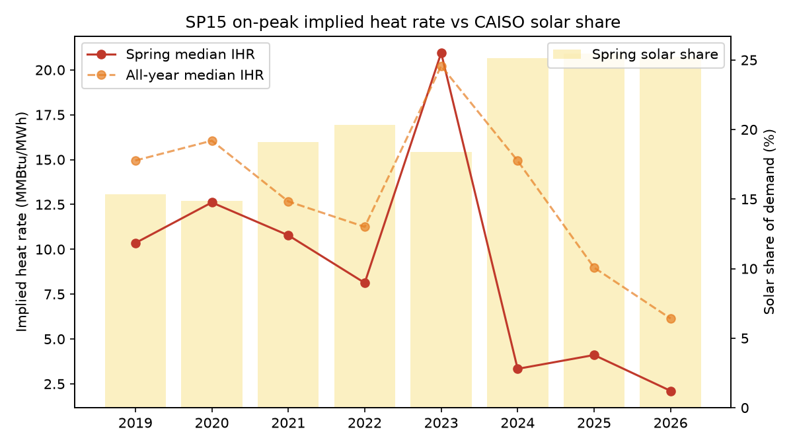
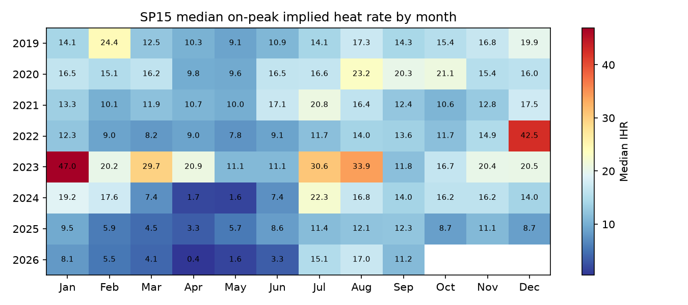
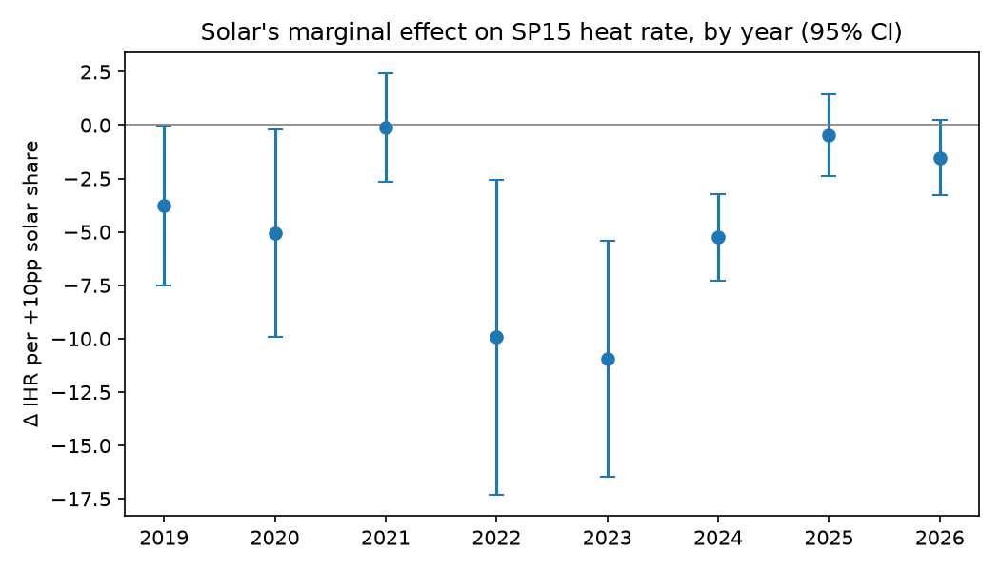
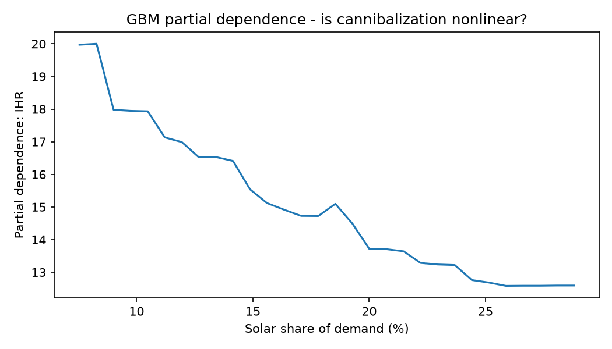

# T01 - Solar cannibalization at SP15

**Thesis.** Rising CAISO solar penetration is compressing the SP15 on-peak implied heat rate,
most visibly in spring. Open question tested below: is each extra point of solar worth *more*
compression over time (saturation) or *less* (storage absorbing the midday surplus)?

## Evidence

| | 2019 | 2026 |
|---|---|---|
| Median on-peak IHR (MMBtu/MWh) | 14.9 | 6.1 |
| Spring median IHR | 10.3 | 2.1 |
| Spring solar share of demand | 15% | 25% |

- **Pooled regression** (month + weekday fixed effects, controls for wind, hydro, demand; HAC s.e.):
  +10pp solar share -> **-7.85 MMBtu/MWh** IHR (95% CI -9.39 to -6.31), n=1366, R²=0.41.
- **Slope by year**: 2019: -3.78 -> 2026: -1.52 per +10pp
  (linear trend +0.27/yr). The marginal effect is **flattening** - the *level* of cannibalization keeps rising with penetration, but the marginal point of solar now bites less. The leading suspect is battery storage shifting midday solar into the evening ramp, which supports on-peak prices. That is thesis T01b.
- The pooled slope is much larger than any single year's because it also absorbs the
  *between-year* drop in IHR as the fleet changed. The by-year slopes isolate the within-year effect.
- **Nonlinearity**: GBM partial dependence moves from 20.0 at 8% solar to 12.6 at 29%.

## Trade expression (hypothesis, not advice)

The level effect argues for structurally lower spring SP15 on-peak heat rates than history implies:
short spring on-peak heat rate (short SP15 power / long gas) when the solar build is on schedule
and hydro is normal-to-wet. The flattening slope is the risk to that view: if storage keeps
absorbing the midday surplus, the *next* GW of solar compresses heat rates less than the last,
and the short gets less attractive each year. Size accordingly.

## Caveats

- On-peak is HE7-22, which straddles the solar trough and the evening ramp; the daily ICE
  product blends both, so true midday cannibalization is larger than shown here.
- Henry Hub, not SoCal Citygate, is the gas denominator. Western gas basis blew out in winter
  2022-23, so IHR is winsorized at the 1st/99th percentile (-0.1-58.5). The 2022-23 slopes
  (and the 2023 IHR spike) are inflated by that basis blowout, which flatters the "flattening" story;
  rerun with 2022-23 excluded before leaning on it.
- Next test (T01b): add EIA-930 battery discharge (fuel type BAT) as a regressor and an
  interaction with solar share. If storage explains the flattening, the solar x battery
  term should be positive and the residual year-trend should disappear.
