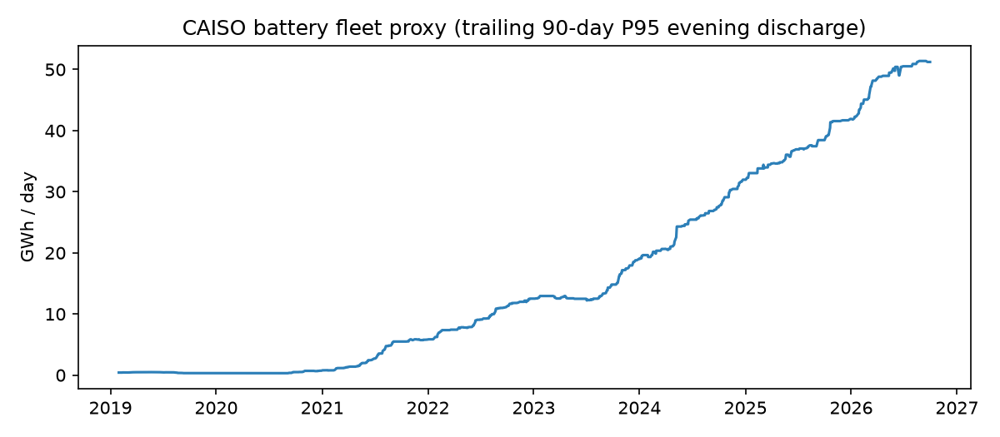
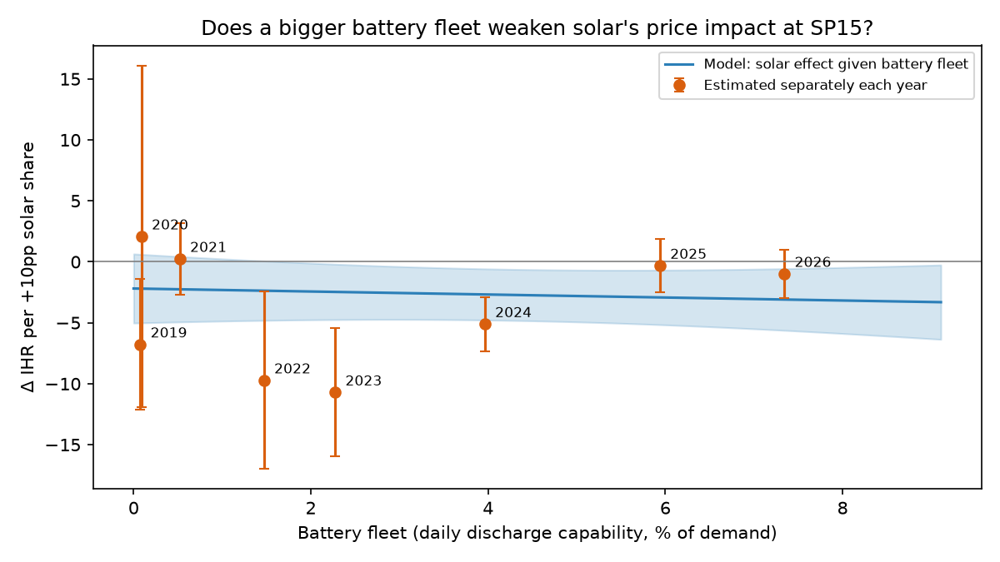

# T01b - Are batteries blunting solar cannibalization at SP15?

**Thesis.** CAISO's battery fleet absorbs midday solar and discharges into the evening ramp,
so each additional point of solar compresses the SP15 on-peak heat rate less than it used to.

**Verdict.** **Not supported.** The solar x battery term is not positive and significant in the main model.

## How storage is measured

CAISO doesn't report batteries as their own EIA-930 fuel; they sit inside "Other". The hourly
shape gives them away: the "Other" series swings from roughly zero in 2019 to about
-7 GW at midday (charging) and +7.6 GW in the evening (discharging) in 2026. The fleet-size
proxy is the trailing 90-day 95th percentile of daily evening discharge. It measures what the
fleet *can* do, not what it did today, because batteries discharge more on high-price days and
using same-day dispatch would bias the result.

## Results

| model                |   solar x battery |   s.e. |   p-value |    n |     R² |
|:---------------------|------------------:|-------:|----------:|-----:|-------:|
| Solar x battery      |           -0.0123 | 0.0231 |    0.5944 | 1197 | 0.4347 |
| + solar x time trend |            0.153  | 0.095  |    0.1072 | 1197 | 0.5054 |
| Excluding 2022-23    |           -0.0004 | 0.0174 |    0.9817 |  847 | 0.5964 |

- Solar's effect with **no batteries**: -2.19 MMBtu/MWh per +10pp solar (s.e. 1.45).
- At the **2026 battery fleet** (7.3% of demand): -3.09 (s.e. 1.29).

If batteries explain the flattening, the orange per-year dots should sit along the blue line.

## What this means

The flattening T01 saw is not explained by batteries. The per-year slopes are noisy, and the
steepest ones (2022-23) are the years Henry Hub most understated western gas, so the
"flattening" is largely the gas-crisis years falling out of the sample, not a trend.

There is also a structural reason batteries shouldn't show up here: the ICE on-peak product is
one average over HE7-22. A battery that charges at noon and discharges at 8pm moves energy
*within* that block, which lowers the evening price and raises the midday price but barely moves
the block average. Batteries should matter a lot for **intraday shape** (midday vs evening
spreads), which daily on-peak prices can't see.

## Trade implication (hypothesis, not advice)

T01's level effect stands: solar keeps pushing the spring on-peak heat rate down, and storage
build so far has not visibly slowed that at the daily-block level. Storage risk to the view
belongs in **shaped** products (evening ramp, super-peak), not the standard on-peak block.
Testing that needs hourly prices, which EIA doesn't publish; CAISO OASIS does, for free.

## Caveats

- Battery fleet growth and time are almost perfectly correlated, so "batteries" may be picking
  up anything else that changed steadily (new transmission, more exports, demand response).
  The solar x time-trend row is the test for that.
- "Other" also includes small non-storage resources, but its 2019 hourly profile is near zero,
  so the swing since then is dominated by storage.
- On-peak is a daily HE7-22 block, so this measures the blended effect, not midday vs evening.
