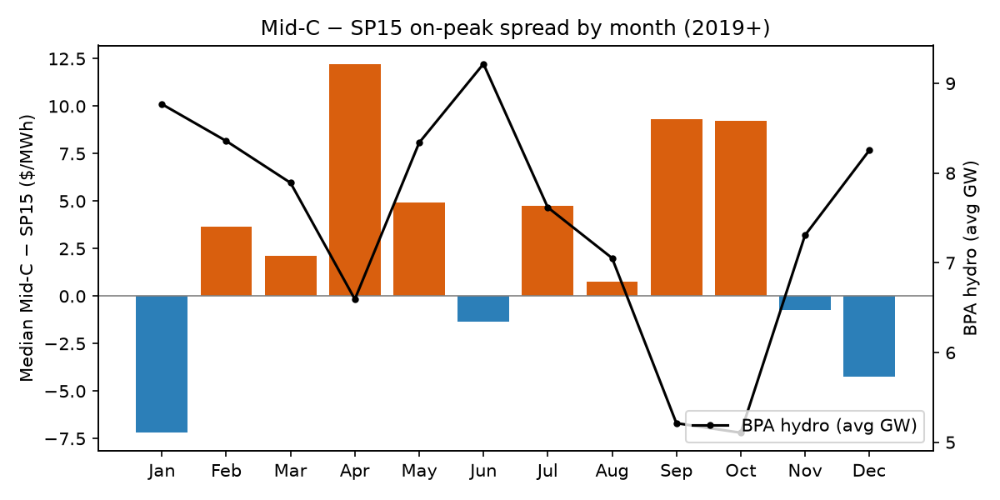
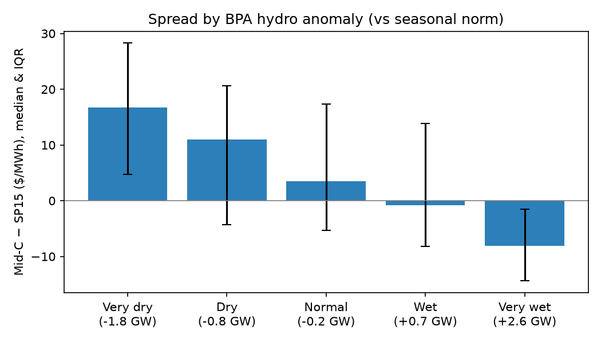

# T02 - The Mid-C vs SP15 spread is a hydro story

**Thesis.** The Mid-C minus SP15 on-peak spread is driven by Pacific Northwest hydro. Above-normal
BPA hydro pushes Mid-C further below SP15, and that signal is usable on the trade date.

**Verdict.** **Supported** on the structural test, and the hydro signal improves next-day spread forecasts by 4% over persistence.

## Evidence

- **Seasonality:** median spread is +5.3 $/MWh in Apr-Jun (runoff) vs -4.1 in Nov-Jan.
  Counter-intuitively, Mid-C is *above* SP15 in the runoff months on average: CAISO solar crushes spring SP15 prices even harder than PNW hydro crushes Mid-C. Seasonality alone is the wrong signal. The hydro *anomaly* (wetter or drier than normal for the month) is what moves the spread.
- **Regression** (controls: BPA wind and load, CAISO solar and load, gas, month and weekday fixed
  effects; HAC s.e.): each +1 GW of BPA hydro above its seasonal norm moves the spread by
  **-5.99 $/MWh** (95% CI -6.82 to -5.17), n=1365, R²=0.55.
- **By hydro quintile:**

| anom_bin   |   anom |   spread |    p25 |   p75 |   days |
|:-----------|-------:|---------:|-------:|------:|-------:|
| Very dry   |  -1.77 |    16.77 |   4.72 | 28.29 |    273 |
| Dry        |  -0.78 |    11    |  -4.25 | 20.63 |    273 |
| Normal     |  -0.18 |     3.5  |  -5.35 | 17.35 |    273 |
| Wet        |   0.65 |    -0.83 |  -8.22 | 13.83 |    273 |
| Very wet   |   2.58 |    -8.07 | -14.32 | -1.49 |    273 |

## Year by year

|   year |   spread |   anom |
|-------:|---------:|-------:|
|   2019 |    -6.25 |   0.05 |
|   2020 |    -9.17 |   1    |
|   2021 |    -0.96 |   0.06 |
|   2022 |    -1.89 |   1.34 |
|   2023 |    20.41 |  -0.78 |
|   2024 |    17.6  |  -0.84 |
|   2025 |    17.22 |  -0.4  |
|   2026 |     5.81 |   0.47 |

Regime shift: the median spread averaged -4.6 $/MWh in 2019-2022 and +15.3 in 2023+.
Mid-C went from trading at a discount to SP15 to trading at a premium. Two likely drivers, not yet
separated: below-normal water in 2023-2025, and SP15's solar-driven decline (T01), with SP15
falling out from under Mid-C. Splitting the two is a good follow-up.

## Forecasting tomorrow's spread (walk-forward, trade-date information only)

| year   |   MAE persistence |   MAE hydro model |
|:-------|------------------:|------------------:|
| 2022   |             18.54 |             17.53 |
| 2023   |             23.64 |             24.63 |
| 2024   |             21.18 |             17.28 |
| 2025   |             10.19 |             10.53 |
| 2026   |              9.29 |              9.19 |
| All    |             16.98 |             16.25 |

Days after an above-normal hydro day: median spread -0.1 $/MWh; after a below-normal day: +17.8.

## Trade expression (hypothesis, not advice)

The Mid-C/SP15 spread is a relative-value position that strips out most of the shared western gas
exposure. A wet water year (high snowpack forecasts from NOAA's Northwest River Forecast Center
in Jan-Apr) argues for **long SP15 / short Mid-C on-peak for Q2**, with the position sized to the
hydro anomaly. Dry years argue for the opposite or flat.

## Caveats

- The seasonal norm is built from 2019-2026, a short and drought-heavy history.
- Transmission limits on the California-Oregon Intertie cap how far the spread can blow out,
  and their outages are not in EIA data.
- Both hubs share Henry Hub as the gas control; their *regional* gas prices (Sumas, SoCal) differ
  and are not available from EIA daily.
