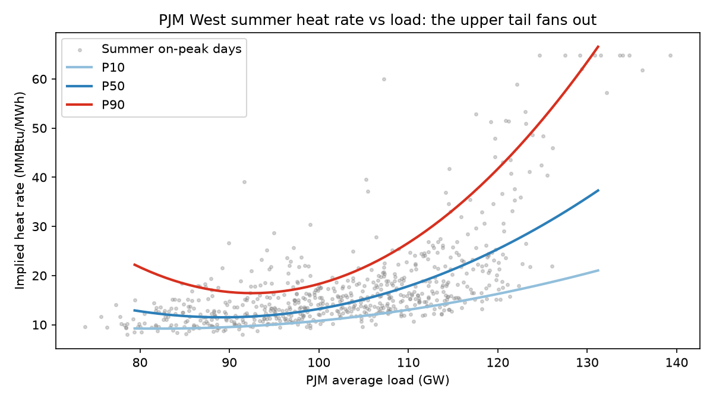

# T03 - PJM West: convex in load, and spike days are visible in advance

**Thesis.** PJM West's on-peak implied heat rate is convex in load: flat-ish in normal conditions,
with an upper tail that blows out on the hottest days. Because the risk is concentrated in a few
days, the EIA day-ahead demand forecast should flag spike days before they trade.

**Verdict.** **Convexity supported.** The P90 heat rate steepens at high load faster than the median does. **Spike days are forecastable** from trade-date information (AUC 0.93 vs 0.84 for yesterday-only).

## 1. The tail fans out (summer, Jun-Sep, quantile regression on load and load²)

Slope of heat rate vs load (MMBtu/MWh per GW):

|   quantile |   slope at 94 GW |   slope at 121 GW |
|-----------:|-----------------:|------------------:|
|        0.1 |            0.114 |             0.383 |
|        0.5 |            0.129 |             0.938 |
|        0.9 |            0.072 |             1.927 |

## 2. Where the money is

|   load_decile |   load_gw |   median_ihr |   p90_ihr |   median_price |   days |
|--------------:|----------:|-------------:|----------:|---------------:|-------:|
|             1 |     82.16 |        11.22 |     14.97 |          27.46 |     65 |
|             2 |     88.58 |        11.48 |     17.66 |          30.82 |     65 |
|             3 |     93.44 |        13.06 |     20.17 |          37.75 |     65 |
|             4 |     97.19 |        13.39 |     21.23 |          36.32 |     65 |
|             5 |    100.79 |        14.78 |     17.71 |          40.48 |     65 |
|             6 |    104.98 |        14.61 |     19.77 |          40.81 |     65 |
|             7 |    108.2  |        16.17 |     21.27 |          44.95 |     65 |
|             8 |    111.98 |        16.71 |     25.27 |          49.24 |     65 |
|             9 |    115.92 |        18.69 |     32.49 |          60.08 |     65 |
|            10 |    123.2  |        35.31 |     64.79 |          97.52 |     65 |

The top load decile is 10% of summer days but carries **39%** of summer on-peak dollars
above the median price. That is what a peak hedge or a long call on PJM West is really paying for.

## 3. Forecasting spike days (walk-forward, trade-date information only)

Spike = heat rate at least 1.5x its trailing 30-day median (all months). Features: the EIA
day-ahead demand forecast and its change from yesterday's actual load, how stretched yesterday's
heat rate already was, the gas price change, and season. "Yesterday only" scores days purely on
yesterday's stretch. It's the persistence baseline, since heat waves last several days.

|   year |   spike days |   days |   AUC yesterday only |   AUC logit |   AUC LightGBM |   Brier base rate |   Brier logit |   Brier LightGBM |
|-------:|-------------:|-------:|---------------------:|------------:|---------------:|------------------:|--------------:|-----------------:|
|   2022 |           16 |    235 |                0.749 |       0.917 |          0.854 |             0.065 |         0.048 |            0.064 |
|   2023 |           10 |    247 |                0.77  |       0.925 |          0.905 |             0.039 |         0.03  |            0.028 |
|   2024 |           20 |    232 |                0.831 |       0.892 |          0.893 |             0.081 |         0.047 |            0.042 |
|   2025 |           30 |    234 |                0.882 |       0.908 |          0.907 |             0.118 |         0.073 |            0.074 |
|   2026 |           43 |    171 |                0.864 |       0.947 |          0.955 |             0.225 |         0.101 |            0.103 |

- Pooled AUC: logistic **0.93**, LightGBM **0.91**, yesterday-only baseline
  **0.84** (0.5 = coin flip). The gap over the baseline is what the load forecast adds.
- On the 10% of days the logistic model ranks most at risk, **66%** were spike days,
  against a 11% base rate.

A lower Brier score than the base rate means the probabilities are better than guessing the average.

## Trade expression (hypothesis, not advice)

Because the payoff is convex in load, the value sits in **optionality**: daily or balance-of-week
PJM West on-peak calls, or heat-rate call options, bought when the model's spike probability is
high relative to what implied volatility charges. The model is a timing filter for when to own
convexity, not a directional price call.

## Caveats

- The EIA "PJM West" price in these files is the **real-time** on-peak index, which is spikier than day-ahead.
- Load is RTO-wide PJM; West hub congestion (for example, Dominion zone) can spike without system-wide load.
- The EIA day-ahead demand forecast is assumed available on the trade date. Its exact publication
  time vs the morning ICE trading window isn't documented, so a live version should use PJM's own
  load forecast, which is published well before trading.
- The P90 curve's upturn at the *low*-load end is an artifact of the quadratic fit, not a real effect.
- No implied volatility data, so "underpriced" can't be tested directly. This shows where the risk
  is and that it's predictable, not that the market misprices it.
