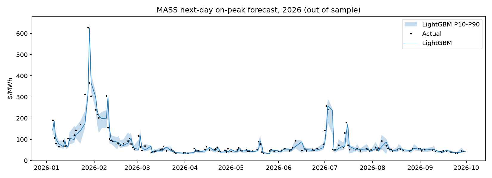

# MASS next-day on-peak price forecast

Walk-forward, expanding window, test years 2022+, n=973 days.

## Overall

| model           |   MAE |   RMSE |   bias |   dir_acc |
|:----------------|------:|-------:|-------:|----------:|
| ridge_heat_rate | 13.12 |  22.45 |  -2.58 |      0.69 |
| lightgbm        | 14.14 |  29.61 |  -1.34 |      0.7  |
| lightgbm_level  | 15.06 |  29.34 |  -5.19 |      0.69 |
| persistence     | 15.16 |  30.71 |  -0    |    nan    |

P10-P90 band coverage: **75%** (target 80%).

## MAE by test year ($/MWh)

|   year |   persistence |   ridge_heat_rate |   lightgbm_level |   lightgbm |
|-------:|--------------:|------------------:|-----------------:|-----------:|
|   2022 |         18.85 |             17.32 |            26.11 |      17.61 |
|   2023 |         10.07 |              9.28 |            10.82 |       9.52 |
|   2024 |         11.18 |             11.15 |             9.14 |      10.39 |
|   2025 |         16.08 |             14.38 |            13.13 |      14.87 |
|   2026 |         21.07 |             13.72 |            16.88 |      19.7  |

