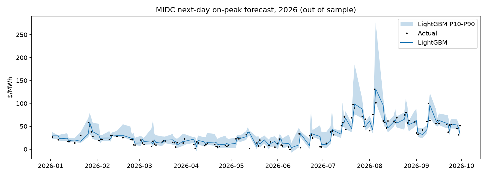

# MIDC next-day on-peak price forecast

Walk-forward, expanding window, test years 2022+, n=838 days.

## Overall

| model           |   MAE |   RMSE |   bias |   dir_acc |
|:----------------|------:|-------:|-------:|----------:|
| lightgbm        | 19.71 |  59.55 |   0.18 |      0.61 |
| persistence     | 20.21 |  60.06 |   0.09 |    nan    |
| lightgbm_level  | 29.22 |  59.52 |  11.97 |      0.55 |
| ridge_heat_rate | 37.56 |  65.21 |  10.77 |      0.56 |

P10-P90 band coverage: **72%** (target 80%).

## MAE by test year ($/MWh)

|   year |   persistence |   ridge_heat_rate |   lightgbm_level |   lightgbm |
|-------:|--------------:|------------------:|-----------------:|-----------:|
|   2022 |         25    |             40.21 |            38.56 |      24.26 |
|   2023 |         28.14 |             38.99 |            39.43 |      27.86 |
|   2024 |         22.8  |             21.52 |            26.32 |      22.24 |
|   2025 |         11.63 |             47.25 |            20.27 |      11.01 |
|   2026 |         10.36 |             39.96 |            17.5  |      10.11 |

