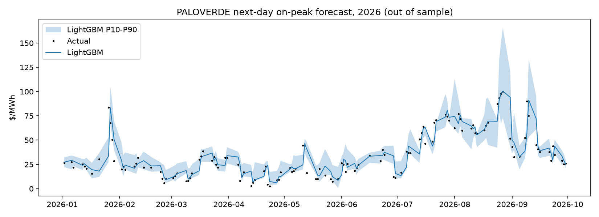

# PALOVERDE next-day on-peak price forecast

Walk-forward, expanding window, test years 2022+, n=837 days.

## Overall

| model           |   MAE |   RMSE |   bias |   dir_acc |
|:----------------|------:|-------:|-------:|----------:|
| lightgbm        | 14.75 |  54.05 |  -0.3  |      0.63 |
| persistence     | 15.2  |  54.29 |   0.05 |    nan    |
| lightgbm_level  | 29.49 |  72.04 |   7.78 |      0.59 |
| ridge_heat_rate | 30.06 |  65.7  |  -6.69 |      0.54 |

P10-P90 band coverage: **70%** (target 80%).

## MAE by test year ($/MWh)

|   year |   persistence |   ridge_heat_rate |   lightgbm_level |   lightgbm |
|-------:|--------------:|------------------:|-----------------:|-----------:|
|   2022 |         23.35 |             68.46 |            44.07 |      23.61 |
|   2023 |         24.54 |             28.74 |            46.19 |      23.82 |
|   2024 |          9.98 |             12.55 |            26.53 |       9.27 |
|   2025 |          7.33 |             19.06 |            11.55 |       6.87 |
|   2026 |          7.88 |             16.12 |            13.2  |       7.19 |

