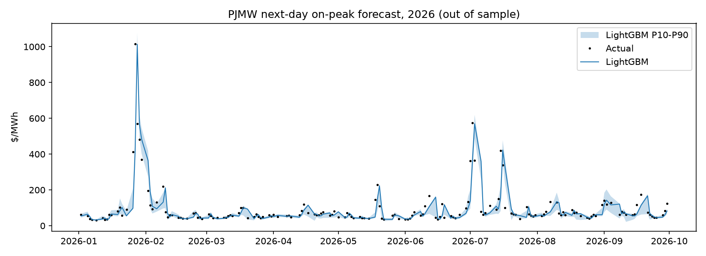

# PJMW next-day on-peak price forecast

Walk-forward, expanding window, test years 2022+, n=1119 days.

## Overall

| model           |   MAE |   RMSE |   bias |   dir_acc |
|:----------------|------:|-------:|-------:|----------:|
| ridge_heat_rate | 12.07 |  29.92 |  -2.52 |      0.71 |
| lightgbm_level  | 12.8  |  38.9  |  -6.33 |      0.69 |
| lightgbm        | 13.77 |  37.22 |  -1.23 |      0.71 |
| persistence     | 15.12 |  38.37 |  -0.09 |    nan    |

P10-P90 band coverage: **67%** (target 80%).

## MAE by test year ($/MWh)

|   year |   persistence |   ridge_heat_rate |   lightgbm_level |   lightgbm |
|-------:|--------------:|------------------:|-----------------:|-----------:|
|   2022 |         14.02 |              9.25 |            15.62 |      12.57 |
|   2023 |          6.29 |              5.19 |             4.88 |       5.61 |
|   2024 |          9.5  |              7.85 |             6.32 |       8.2  |
|   2025 |         13.41 |             15.17 |            11.48 |      11.76 |
|   2026 |         39.39 |             27.35 |            30.95 |      37.53 |

