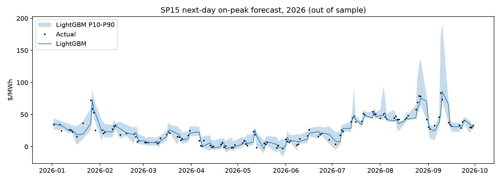

# SP15 next-day on-peak price forecast

Walk-forward, expanding window, test years 2022+, n=817 days.

## Overall

| model           |   MAE |   RMSE |   bias |   dir_acc |
|:----------------|------:|-------:|-------:|----------:|
| lightgbm        | 10.12 |  22.85 |  -0.6  |      0.69 |
| persistence     | 11.04 |  23.62 |   0.06 |    nan    |
| ridge_heat_rate | 16.83 |  29.43 |   1.27 |      0.64 |
| lightgbm_level  | 18.97 |  33.61 |   9.95 |      0.6  |

P10-P90 band coverage: **72%** (target 80%).

## MAE by test year ($/MWh)

|   year |   persistence |   ridge_heat_rate |   lightgbm_level |   lightgbm |
|-------:|--------------:|------------------:|-----------------:|-----------:|
|   2022 |         17.44 |             32.37 |            32.02 |      16.26 |
|   2023 |         15.3  |             19.24 |            30.92 |      14.31 |
|   2024 |          8.06 |              8.51 |            13.18 |       7.27 |
|   2025 |          6.56 |             11.34 |             7.03 |       5.74 |
|   2026 |          6.41 |             10.76 |             8.5  |       5.66 |

